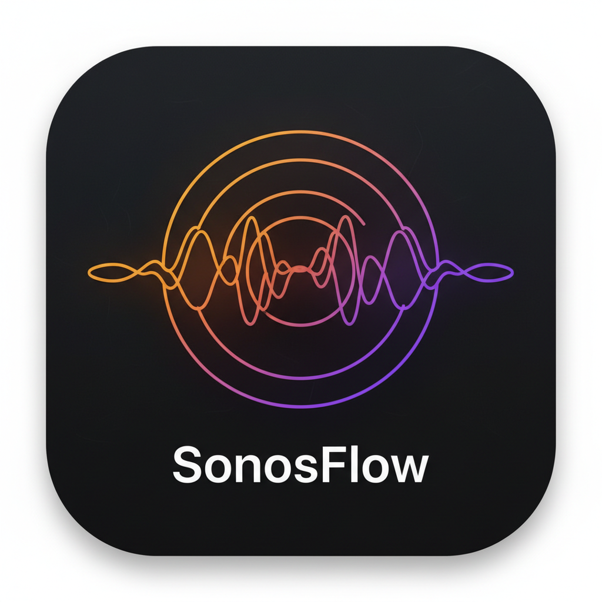

# SonosFlow

<p align="center">
  
</p>

<p align="center">
  <strong>A native macOS Sonos controller powered by the homectl Model Context Protocol (MCP) server.</strong>
</p>

<p align="center">
  <a href="#disclaimer">Disclaimer</a> •
  <a href="#prerequisites--dependency">Prerequisites</a> •
  <a href="#quick-start">Quick Start</a> •
  <a href="docs/user-guide.md">User Guide</a> •
  <a href="#features">Features</a> •
  <a href="#keyboard-shortcuts">Keyboard Shortcuts</a> •
  <a href="#development--testing">Development</a> •
  <a href="#documentation">Documentation</a> •
  <a href="#contributing">Contributing</a> •
  <a href="#license">License</a>
</p>

---

## Disclaimer

> ### ⚠️ Important Legal Notice
> **SonosFlow is an independent, open-source community tool. It is NOT an official Sonos product and is NOT affiliated with, sponsored by, maintained by, or endorsed by Sonos, Inc. in any way.**
>
> "Sonos" and Sonos product names (such as Sonos Arc, Play:1, Play:3, Move, and Port) are registered trademarks of Sonos, Inc. All other trademarks and registered trademarks belong to their respective owners.

---

SonosFlow is a lightweight, standalone macOS application built with Swift and SwiftUI for macOS 14 Sonoma and later. Similar to [LyriaFlow](https://github.com/ghchinoy/LyriaFlow), it connects directly to an MCP server—in this case, [`homectl-sonos`](https://ghchinoy.github.io/homectl/)—over local stdio JSON-RPC. It gives you immediate visibility and control over all Sonos speaker groups, playback queues, artwork thumbnails, volume adjustments, and pinned favorites across your household.

---

## Prerequisites & Dependency

SonosFlow **requires the [`homectl`](https://ghchinoy.github.io/homectl/) Sonos Model Context Protocol (MCP) server (`mcp-sonos`) to be built or installed**. SonosFlow communicates directly with this binary over local stdio JSON-RPC without third-party daemons or cloud bridges.

Before launching SonosFlow, verify or build `mcp-sonos`:

```bash
# 1. Navigate to your homectl repository
cd /path/to/homectl

# 2. Build the mcp-sonos binary
make build
# Binary is produced at: /path/to/homectl/bin/mcp-sonos
```

SonosFlow automatically discovers `mcp-sonos` at:
- `../homectl/bin/mcp-sonos`
- `~/projects/homectl/bin/mcp-sonos`
- `~/go/bin/mcp-sonos`
- `/usr/local/bin/mcp-sonos`
- `/opt/homebrew/bin/mcp-sonos`

You can also configure a custom path anytime in **Settings (`⌘,`)**.

---

## Quick Start

### Installation & Run

```bash
# Clone the repository
git clone https://github.com/ghchinoy/sonos-swift-mcp.git
cd sonos-swift-mcp

# Build and launch the application immediately
make run
```

To assemble a standalone macOS `.app` bundle:
```bash
make app
# Output: SonosFlow.app (ready to move to ~/Applications)
```

---

## Immediate Usage

1. **Select a Room**: When launched, SonosFlow scans your local network and groups speakers into zone groups (including stereo pairs and multi-room clusters) in the left sidebar.
2. **Control Playback**: Press `Space` to toggle playback, or use `⌘→` / `⌘←` to skip tracks.
3. **Adjust Volume**: Slide the volume slider or press `⌘↑` / `⌘↓` to adjust master coordinator volume in 5% increments.
4. **Switch Queue Tracks**: Double-click any track in the queue (or click its hover play icon) to seek directly to that track.
5. **Mode A MiniPlayer (`⌘M`)**: Press `⌘M` to morph the window into an always-on-top floating widget that follows you across desktop spaces.
6. **Export Album Art**: Drag the proxy icon in the macOS window title bar straight to your Desktop, Mail, or Messages.

---

## Features

- **Direct MCP Integration**: Zero-daemon architecture communicating directly with `mcp-sonos` via stdio JSON-RPC 2.0.
- **Hardware Media Keys & macOS Control Center**: Integrates with Apple's `MediaPlayer` framework so Mac physical keys (F7, F8, F9), AirPods, and the macOS Now Playing widget control SonosFlow.
- **Audio Stream Player & Radio Presets**: Stream arbitrary internet radio, podcasts, and Icecast URLs (`⌘U`) with built-in presets (SomaFM, KEXP, BBC 6) and recent history.
- **Expandable Group Volumes**: Individual speaker volume sliders for stereo pairs and multi-room clusters with independent speaker level balancing.
- **Mode A Floating MiniPlayer**: Seamlessly morphs the main window between a full split-view layout and a compact (340×110 pt) floating card (`⌘M`).
- **macOS Title Bar Proxy Icon**: Draggable document icon in the title bar representing the cached album cover image.
- **Two-Tier Album Artwork Cache**: Fast in-memory `NSCache` and SHA-256 persistent disk storage (`~/Library/Caches/com.sonosflow.app/Artwork/`) with live cache size management in Settings.
- **Menu Bar Extra Companion**: Status bar icon for switching rooms, checking now-playing status, adjusting volume, and triggering pinned favorites.
- **Multi-Group & Stereo-Pair Support**: Discovers and identifies zone coordinators, stereo pairs (e.g. paired Play:1s), and multi-room groups with automatic coordinator IP resolution.
- **Interactive Playback Queue**: View all queued tracks with position index, artwork thumbnail, title, artist, album, duration, and animated active-track indicators.
- **Pinned Sonos Favorites**: Browse and start playback of pinned playlists, radio stations, and cloud containers (e.g. YouTube Music, Sonos Radio) from a dedicated sheet (`⌘F`).
- **Apple macOS HIG Design**: Built natively with macOS `.ultraThinMaterial` translucency, San Francisco typography, responsive split-view ergonomics, and keyboard shortcuts.
- **Persistent Diagnostics**: Full logging to `~/Library/Logs/SonosFlow/sonosflow.log`.

---

## Architecture

SonosFlow is organized into a modular Swift Package architecture:

```
sonos-swift-mcp/
├── Package.swift                     # Swift 5.9+ SPM manifest (.macOS(.v14))
├── Makefile                          # Build, test, run, app packaging, docs, and spike targets
├── scripts/
│   └── build_app.sh                  # macOS application bundle builder
├── Resources/
│   ├── AppIcon.icns                  # macOS application icon bundle
│   └── AppIcon.png
├── docs/                             # Astro Starlight documentation site & guides
│   ├── astro.config.mjs
│   ├── package.json
│   ├── user-guide.md                 # Complete standalone user guide
│   ├── official-mcp-comparison.md    # homectl vs official Sonos 27mcp analysis
│   └── src/content/docs/             # Starlight collections (guides, architecture, reference)
│
├── Sources/
│   ├── SonosFlow/                    # App entry point & NSApplication delegate
│   │   └── App/SonosFlowApp.swift    # WindowGroup, MenuBarExtra, DockMenu, CommandMenus
│   │
│   ├── SonosFlowKit/                 # Core framework library
│   │   ├── Models/                   # SonosModels, MCPModels, AppSettings
│   │   ├── Services/                 # MCPClient (FIFO AsyncStream), SonosService,
│   │   │                             # ArtworkCache (Two-Tier), NowPlayingMediaManager, AppLogger
│   │   ├── ViewModels/               # Modularized SonosCoordinator (@MainActor):
│   │   │                             #   • SonosCoordinator.swift (Core state & lifecycle)
│   │   │                             #   • SonosCoordinator+Discovery.swift (Failover & seeds)
│   │   │                             #   • SonosCoordinator+Queue.swift (Multi-page & mutations)
│   │   │                             #   • SonosCoordinator+Volume.swift (Debounce & balancing)
│   │   │                             #   • SonosCoordinator+Playback.swift (Transport & streams)
│   │   └── Views/                    # MainSplitView, MiniPlayerView, MenuBarView,
│   │                                 # SpeakerSidebarView, NowPlayingCardView,
│   │                                 # QueueListView, StreamPlayerSheetView,
│   │                                 # GroupVolumePopoverView, FavoritesPopoverView,
│   │                                 # TransportBarView, SettingsView, WindowAccessor
│   │
│   ├── SonosFlowSpike/               # Headless CLI verification spike for local homectl-sonos
│   │   └── main.swift
│   │
│   └── SonosOfficialMCPSpike/        # Headless CLI exploration spike for official hosted Sonos 27mcp
│       └── main.swift
│
└── Tests/
    └── SonosFlowTests/               # Unit test suite (21 tests with MockSonosService)
        └── SonosFlowTests.swift
```

---

## Keyboard Shortcuts

| Shortcut | Action | Description |
|---|---|---|
| `Space` / `F8` | Play / Pause | Toggle playback on active speaker group (supports Mac F8 hardware key) |
| `⌘ →` / `F9` | Next Track | Skip to next track in queue (supports Mac F9 hardware key) |
| `⌘ ←` / `F7` | Previous Track | Return to previous track (supports Mac F7 hardware key) |
| `⌘ ↑` | Volume Up | Increase master volume (+5%) |
| `⌘ ↓` | Volume Down | Decrease master volume (-5%) |
| `⌘ ⌥ ↓` | Mute / Unmute | Toggle volume mute on active room (restores previous level on unmute) |
| `⌘ U` | Audio Stream | Open Audio Stream Player dialog with presets & custom URLs |
| `⌘ M` | Toggle MiniPlayer | Morph window between full split-view and floating miniplayer |
| `Esc` | Clear Filter / Exit | Clear queue filter (when filtering) or exit MiniPlayer |
| `Return` | Play Selected | Play highlighted song in playback queue |
| `Delete` / `⌫` | Remove Selected | Remove highlighted song from playback queue |
| `⌘ R` | Refresh | Refresh speaker groups & queue |
| `⌘ ⇧ R` | Reload MCP Server | Restart `mcp-sonos` child process and reload registered tools |
| `⌘ F` | Favorites | Open pinned Sonos favorites sheet |
| `⌘ 1...9` | Switch Room | Switch active speaker group to room #1 through #9 |
| `⌘ ,` | Settings | Open Settings / Preferences |
| `⌘ Q` | Quit | Quit application and cleanly stop child processes |

---

## Development & Testing

### Running Unit Tests
```bash
make test
```
Executes the full unit test suite (21 tests) using `MockSonosService` covering topology candidate failover (Move 2 -> Play:1), multi-page queue pagination (188+ tracks), optimistic mutation rollbacks on server errors, volume jitter debouncing, mute state restoration, and preset persistence.

### Running the Live Local Spike
```bash
make spike
```
Runs `SonosFlowSpike` in headless mode to verify local process spawning, MCP handshake, speaker discovery, now-playing inspection, and queue retrieval against your physical Sonos network.

### Exploring the Official Hosted Sonos 27mcp Server
```bash
make official-spike
```
Runs `SonosOfficialMCPSpike` to authenticate with your Sonos account via OAuth 2.1 PKCE, connect to `https://mcp.ws.sonos.com/mcp`, benchmark cloud latency, and dump all 34 official cloud tools into `docs/official-mcp-tools.json`.

---

## Local homectl vs. Official Sonos 27mcp

SonosFlow defaults to local **`homectl-sonos`** for ultra-low latency (<10ms), offline reliability, and deep physical queue manipulation (`Q:0`). For a side-by-side comparison with Sonos's newly released official cloud server, read **[Comparative Analysis: homectl-sonos vs. Official Sonos 27mcp](docs/official-mcp-comparison.md)** or view the live documentation.

---

## Documentation

For an end-to-end walkthrough of every feature, read the **[SonosFlow User Guide](docs/user-guide.md)**.

SonosFlow also includes an [Astro Starlight](https://starlight.astro.build/) documentation site with architecture deep-dives, protocol specifications, user guides, and troubleshooting:

```bash
# Install docs dependencies
make docs-install

# Start local documentation server
make docs-dev

# Build static production documentation site
make docs-build
```

---

## Make Targets

| Target | Description |
|---|---|
| `make run` | Builds debug binary and launches `SonosFlow.app`. |
| `make run-cli` | Runs `SonosFlow` directly in the terminal via `swift run`. |
| `make build` | Compiles debug binaries for all targets. |
| `make spike` | Runs local `homectl-sonos` MCP verification spike. |
| `make official-spike` | Runs official hosted `Sonos 27mcp` exploration spike. |
| `make test` | Executes the 21-test automated unit test suite. |
| `make app` | Builds an optimized release `.app` bundle. |
| `make docs-dev` | Starts local Astro Starlight docs development server. |
| `make docs-build` | Compiles the production Astro documentation site. |
| `make clean` | Cleans build artifacts, `.app` bundles, and temporary caches. |

---

## Contributing

Pull requests are welcome! For major architectural changes or new features:
1. Please open an issue first to discuss what you would like to change.
2. Ensure new features adhere to Apple's macOS Human Interface Guidelines.
3. Verify that all unit tests pass with `make test` before submitting.

---

## License

SonosFlow is open-source software licensed under the **Apache-2.0 License**. See [LICENSE](LICENSE) for details.
