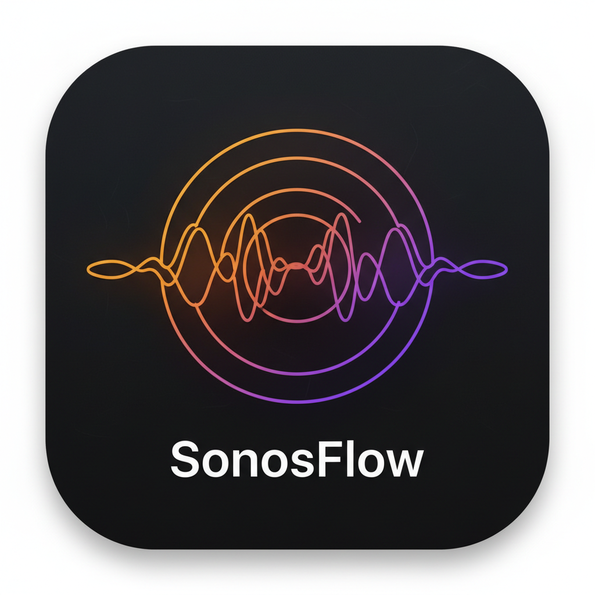
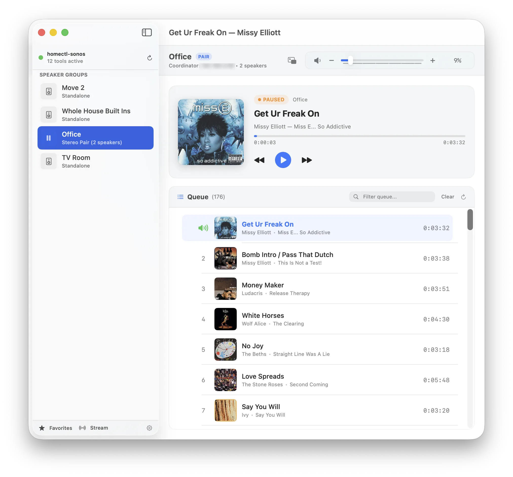

# SonosFlow

<p align="center">
  
</p>

<p align="center">
  <strong>A native macOS Sonos controller powered by the local homectl MCP server or the Sonos 27mcp server.</strong>
</p>

<p align="center">
  
</p>

<p align="center">
  <a href="#disclaimer">Disclaimer</a> •
  <a href="#dual-engine-architecture">Dual Engines</a> •
  <a href="#prerequisites">Prerequisites</a> •
  <a href="#quick-start">Quick Start</a> •
  <a href="docs/user-guide.md">User Guide</a> •
  <a href="#features">Features</a> •
  <a href="#keyboard-shortcuts">Keyboard Shortcuts</a> •
  <a href="#development--testing">Development</a> •
  <a href="#documentation">Documentation</a> •
  <a href="#contributing">Contributing</a> •
  <a href="#license">License</a>
</p>

---

## Disclaimer

> ### ⚠️ Important Legal Notice
> **SonosFlow is an independent, open-source community tool. It is NOT an official Sonos product and is NOT affiliated with, sponsored by, maintained by, or endorsed by Sonos, Inc. in any way.**
>
> "Sonos" and Sonos product names (such as Sonos Arc, Play:1, Play:3, Move, and Port) are registered trademarks of Sonos, Inc. All other trademarks and registered trademarks belong to their respective owners.

---

SonosFlow is a lightweight, standalone macOS application built with Swift and SwiftUI for macOS 14 Sonoma and later. Similar to [LyriaFlow](https://github.com/ghchinoy/LyriaFlow), it connects directly to a Model Context Protocol (MCP) server conforming to standard `2024-11-05`.

SonosFlow features a seamless **Dual-Engine Architecture**:
1. **Local Network Engine (`homectl-sonos`) [Recommended Default]**: Connects directly to the local [`homectl`](https://ghchinoy.github.io/homectl/) Go binary via stdio JSON-RPC 2.0. Delivers ultra-low latency (<10ms), offline LAN operation, direct 188-track queue reordering and deletion (`Q:0`), and local radio stream playback (`⌘U`).
2. **Sonos Cloud Engine (The Sonos 27mcp Server)**: Connects to Sonos's official hosted endpoint at `https://mcp.ws.sonos.com/mcp` (announced in Sonos's blog post [*Meet Sonos 27*](https://www.sonos.com/en-us/blog/meet-sonos-27)) using OAuth 2.1 PKCE with credentials stored securely in the macOS Keychain. Allows remote control across guest Wi-Fi, VPNs, or away from home, with single-track Up Next preview.

You can switch between engines at any time in **Settings (`⌘,`)**. SonosFlow dynamically inspects negotiated server tools (`tools/list`) and automatically gates available UI features.

---

## Choosing an Engine

| Capability | Local Engine (`homectl-sonos`) [Default] | [The Sonos 27mcp Server](https://www.sonos.com/en-us/blog/meet-sonos-27) (Official Cloud) |
|---|---|---|
| **Architecture** | Edge-first local process pipe (`stdio`) | Hosted SaaS over HTTPS/TLS (`mcp.ws.sonos.com`) |
| **Authentication** | **Zero login required** (LAN auto-discovery) | **OAuth 2.1 PKCE** (Sonos account login in browser) |
| **Latency** | **< 10ms** (Instant local dispatch) | **~220ms – 600ms** (Internet cloud transit) |
| **Offline / Airgap** | **100% Offline Capable** | Requires active WAN internet connection |
| **Queue Management** | **Direct Q:0 editing**: 188-track drag reorder, hover delete | **Zero queue tools** (Replaced by "Up Next" preview card) |
| **Audio Streams (`⌘U`)** | Supported (Direct UPnP stream playback) | Not supported (Hidden in UI) |
| **Sonos Favorites** | Supported (Pinned playlists & stations) | Supported (Pinned household favorites) |
| **Remote / Multi-VLAN** | Subnet-local | Works across VLANs, guest Wi-Fi, and away from home |

For a complete deep-dive comparison and protocol analysis, read **[Comparative Analysis: homectl-sonos vs. The Sonos 27mcp Server](docs/official-mcp-comparison.md)**.

---

## Prerequisites

### For Local Engine (`homectl-sonos`) [Recommended Default]
Requires the [`homectl`](https://ghchinoy.github.io/homectl/) Sonos MCP server binary (`mcp-sonos`):

```bash
# 1. Navigate to your homectl repository
cd /path/to/homectl

# 2. Build the mcp-sonos binary
make build
# Binary is produced at: /path/to/homectl/bin/mcp-sonos
```

SonosFlow automatically discovers `mcp-sonos` at standard paths (`~/projects/homectl/bin/mcp-sonos`, `~/go/bin/mcp-sonos`, `/usr/local/bin/mcp-sonos`, `/opt/homebrew/bin/mcp-sonos`), or you can set a custom path in Settings (`⌘,`).

### For Cloud Engine (The Sonos 27mcp Server)
No local binary is needed! Simply:
1. Open **Settings (`⌘,`)**.
2. Select **Sonos Cloud (Official 27mcp)**.
3. Click **Sign In with Sonos...** to authorize in your browser. Tokens are saved securely in your macOS Keychain.

---

## Quick Start

### Building & Running

```bash
# Clone the repository
git clone https://github.com/ghchinoy/SonosFlow.git
cd SonosFlow

# Build and launch immediately in debug mode
make run
```

### Installing Locally

Install the release bundle directly into your user's `~/Applications` folder:

```bash
# Build release bundle and install to ~/Applications/SonosFlow.app
make install

# Launch installed app
open ~/Applications/SonosFlow.app
```

To install system-wide for all users instead:
```bash
make install INSTALL_DIR=/Applications
```

To uninstall:
```bash
make uninstall
```
*(Your settings, Keychain tokens, and album artwork cache are safely preserved).*

> **Note on Keychain Permission**: When running the installed app in Cloud mode for the first time, macOS may prompt once to grant the installed `SonosFlow.app` access to your previously saved Sonos Cloud token in Keychain.

---

## Immediate Usage

1. **Select a Room**: When launched, SonosFlow scans your system and lists speaker groups (including stereo pairs and multi-room clusters) in the left sidebar.
2. **Control Playback**: Press `Space` to toggle playback, or use `⌘→` / `⌘←` to skip tracks.
3. **Adjust Volume**: Slide the volume slider or press `⌘↑` / `⌘↓` to adjust master room volume in 5% increments. Click `slider.horizontal.2` on stereo pairs for individual speaker balancing.
4. **Switch Queue Tracks** *(Local Engine)*: Double-click any track in the queue (or click its hover play icon) to seek directly to that track.
5. **Mode A MiniPlayer (`⌘M`)**: Press `⌘M` to morph the window into an always-on-top floating desktop widget that follows you across virtual desktop spaces.
6. **Export Album Art**: Drag the proxy icon in the macOS window title bar straight to your Desktop, Mail, Messages, or Slack.

---

## Features

- **Dual-Engine Architecture**: Seamlessly switch between local edge-first control (`homectl-sonos`) and hosted cloud control (the Sonos 27mcp server) in Settings (`⌘,`).
- **Dynamic Feature Gating (`ServerCapabilities`)**: Automatically adapts UI elements based on the active server's negotiated `tools/list`:
  - **Full Playback Queue** on Local Engine: 188-track drag-and-drop reordering, hover deletion, and "Play Next".
  - **Up Next Preview Card** on Cloud Engine: Compact preview card displaying the next scheduled track with album artwork and skip button.
  - **Audio Stream Player (`⌘U`)**: Live audio streaming with curated presets (SomaFM, KEXP, BBC 6) and custom saving (Local Engine).
- **Hardware Media Keys & macOS Control Center**: Integrates with Apple's `MediaPlayer` framework so Mac physical keys (F7, F8, F9), AirPods, and the macOS Now Playing widget control SonosFlow.
- **Expandable Group Volumes**: Individual speaker volume sliders for stereo pairs and multi-room clusters with independent speaker level balancing.
- **Mode A Floating MiniPlayer**: Seamlessly morphs the main window between a full split-view layout and a compact (340×110 pt) floating card (`⌘M`).
- **macOS Title Bar Proxy Icon**: Draggable document icon in the title bar representing the cached album cover image.
- **Two-Tier Album Artwork Cache**: Fast in-memory `NSCache` and SHA-256 persistent disk storage (`~/Library/Caches/com.sonosflow.app/Artwork/`) with live cache size management in Settings.
- **Menu Bar Extra Companion**: Status bar icon for switching rooms, checking now-playing status, adjusting volume, and triggering pinned favorites.
- **Multi-Group & Stereo-Pair Support**: Discovers and identifies zone coordinators, stereo pairs (e.g. paired Play:1s), and multi-room groups with automatic coordinator IP resolution.
- **Pinned Sonos Favorites**: Browse and start playback of pinned playlists, radio stations, and cloud containers (e.g. YouTube Music, Sonos Radio) from a dedicated sheet (`⌘F`).
- **Apple macOS HIG Design**: Built natively with macOS `.ultraThinMaterial` translucency, San Francisco typography, responsive split-view ergonomics, and keyboard shortcuts.
- **Persistent Diagnostics**: Full logging to `~/Library/Logs/SonosFlow/sonosflow.log`.

---

## Architecture

SonosFlow is organized into a modular Swift Package architecture:

```
sonos-swift-mcp/
├── Package.swift                     # Swift 5.9+ SPM manifest (.macOS(.v14))
├── Makefile                          # Build, test, run, app packaging, install, docs, and spike targets
├── scripts/
│   ├── build_app.sh                  # macOS application bundle builder
│   └── screenshot-to-webp.sh         # Tooling for WebP screenshots with IP blurring
├── Resources/
│   ├── AppIcon.icns                  # macOS application icon bundle
│   └── AppIcon.png
├── docs/                             # Astro Starlight documentation site & guides
│   ├── astro.config.mjs
│   ├── package.json
│   ├── user-guide.md                 # Complete standalone user guide
│   ├── official-mcp-comparison.md    # homectl vs the Sonos 27mcp server analysis
│   ├── official-mcp-tools.json       # Complete 34-tool schema snapshot from mcp.ws.sonos.com
│   ├── SHOTLIST.md                   # Visual asset catalog & capture guidelines
│   └── src/content/docs/             # Starlight collections (guides, architecture, reference)
│
├── Sources/
│   ├── SonosFlow/                    # App entry point & NSApplication delegate
│   │   └── App/SonosFlowApp.swift    # WindowGroup, MenuBarExtra, DockMenu, CommandMenus
│   │
│   ├── SonosFlowKit/                 # Core framework library
│   │   ├── Models/                   # SonosModels, MCPModels, AppSettings, ServerCapabilities
│   │   ├── Services/                 # SonosBackend (Protocol), LocalHomectlBackend, SonosCloudBackend,
│   │   │                             # CloudMCPClient (OAuth 2.1 PKCE), CloudTokenStorage (Keychain),
│   │   │                             # MCPClient (FIFO AsyncStream), SonosService,
│   │   │                             # ArtworkCache (Two-Tier), NowPlayingMediaManager, AppLogger
│   │   ├── ViewModels/               # Modularized SonosCoordinator (@MainActor):
│   │   │                             #   • SonosCoordinator.swift (Core state & engine switching)
│   │   │                             #   • SonosCoordinator+Discovery.swift (Failover & seeds)
│   │   │                             #   • SonosCoordinator+Queue.swift (Multi-page & mutations)
│   │   │                             #   • SonosCoordinator+Volume.swift (Debounce & balancing)
│   │   │                             #   • SonosCoordinator+Playback.swift (Transport & streams)
│   │   └── Views/                    # MainSplitView, MiniPlayerView, MenuBarView,
│   │                                 # SpeakerSidebarView, NowPlayingCardView,
│   │                                 # QueueListView (Queue & Up Next), StreamPlayerSheetView,
│   │                                 # GroupVolumePopoverView, FavoritesPopoverView,
│   │                                 # TransportBarView, SettingsView, WindowAccessor
│   │
│   ├── SonosFlowSpike/               # Headless CLI verification spike for local homectl-sonos
│   │   └── main.swift
│   │
│   └── SonosOfficialMCPSpike/        # Headless CLI exploration spike for the Sonos 27mcp server
│       └── main.swift
│
└── Tests/
    └── SonosFlowTests/               # Unit test suite (31 tests with MockSonosService & MockSonosBackend)
        └── SonosFlowTests.swift
```

---

## Keyboard Shortcuts

| Shortcut | Action | Description |
|---|---|---|
| `Space` / `F8` | Play / Pause | Toggle playback on active speaker group (supports Mac F8 hardware key) |
| `⌘ →` / `F9` | Next Track | Skip to next track in queue (supports Mac F9 hardware key) |
| `⌘ ←` / `F7` | Previous Track | Return to previous track (supports Mac F7 hardware key) |
| `⌘ ↑` | Volume Up | Increase master volume (+5%) |
| `⌘ ↓` | Volume Down | Decrease master volume (-5%) |
| `⌘ ⌥ ↓` | Mute / Unmute | Toggle volume mute on active room (restores previous level on unmute) |
| `⌘ U` | Audio Stream | Open Audio Stream Player dialog with presets & custom URLs *(Local Engine)* |
| `⌘ M` | Toggle MiniPlayer | Morph window between full split-view and floating miniplayer |
| `Esc` | Clear Filter / Exit | Clear queue filter (when filtering) or exit MiniPlayer |
| `Return` | Play Selected | Play highlighted song in playback queue *(Local Engine)* |
| `Delete` / `⌫` | Remove Selected | Remove highlighted song from playback queue *(Local Engine)* |
| `⌘ R` | Refresh | Refresh speaker groups & queue |
| `⌘ ⇧ R` | Reload MCP Server | Restart backend process and reload registered tools |
| `⌘ F` | Favorites | Open pinned Sonos favorites sheet |
| `⌘ 1...9` | Switch Room | Switch active speaker group to room #1 through #9 |
| `⌘ ,` | Settings | Open Settings / Preferences (engine switcher, cloud sign-in, cache) |
| `⌘ Q` | Quit | Quit application and cleanly stop child processes |

---

## Development & Testing

### Running Unit Tests
```bash
make test
```
Executes the full unit test suite (31 tests) using `MockSonosService` and `MockSonosBackend` covering topology candidate failover (Move 2 -> Play:1), multi-page queue pagination (188+ tracks), optimistic mutation rollbacks on server errors, volume jitter debouncing, mute state restoration, preset persistence, engine switching, dynamic schema inspection (control-bjv), and live cloud JSON fixture parsing.

### Running the Live Local Spike
```bash
make spike
```
Runs `SonosFlowSpike` in headless mode to verify local process spawning, MCP handshake, speaker discovery, now-playing inspection, and queue retrieval against your physical Sonos network.

### Exploring the Sonos 27mcp Server
```bash
make official-spike
```
Runs `SonosOfficialMCPSpike` to authenticate with your Sonos account via OAuth 2.1 PKCE, connect to `https://mcp.ws.sonos.com/mcp`, benchmark cloud latency, and dump all 34 official cloud tools into `docs/official-mcp-tools.json`.

---

## Local homectl vs. The Sonos 27mcp Server

SonosFlow defaults to local **`homectl-sonos`** for ultra-low latency (<10ms), offline reliability, and deep physical queue manipulation (`Q:0`). For a side-by-side comparison with [the Sonos 27mcp server](https://www.sonos.com/en-us/blog/meet-sonos-27), read **[Comparative Analysis: homectl-sonos vs. The Sonos 27mcp Server](docs/official-mcp-comparison.md)** or view the live documentation.

---

## Documentation

For an end-to-end walkthrough of every feature, read the **[SonosFlow User Guide](docs/user-guide.md)**.

SonosFlow also includes an [Astro Starlight](https://starlight.astro.build/) documentation site with architecture deep-dives, protocol specifications, user guides, and troubleshooting:

```bash
# Install docs dependencies
make docs-install

# Start local documentation server
make docs-dev

# Build static production documentation site
make docs-build

# Preview built static site
make docs-preview
```

---

## Make Targets

| Target | Description |
|---|---|
| `make run` | Builds debug binary and launches `SonosFlow.app`. |
| `make run-cli` | Runs `SonosFlow` directly in the terminal via `swift run`. |
| `make build` | Compiles debug binaries for all targets. |
| `make install` | Installs release bundle to `~/Applications/SonosFlow.app` (or `INSTALL_DIR=...`). |
| `make uninstall` | Removes bundle from `~/Applications/SonosFlow.app`. |
| `make app` | Builds an optimized release `.app` bundle. |
| `make test` | Executes the 31-test automated unit test suite. |
| `make spike` | Runs local `homectl-sonos` MCP verification spike. |
| `make official-spike` | Runs official hosted `Sonos 27mcp` exploration spike. |
| `make docs-install` | Installs Astro Starlight documentation dependencies. |
| `make docs-dev` | Starts local Astro Starlight docs development server. |
| `make docs-build` | Compiles the production Astro documentation site. |
| `make docs-preview` | Previews the compiled documentation site locally. |
| `make clean` | Cleans build artifacts, `.app` bundles, and temporary caches. |

---

## Contributing

Pull requests are welcome! For major architectural changes or new features:
1. Please open an issue first to discuss what you would like to change.
2. Ensure new features adhere to Apple's macOS Human Interface Guidelines.
3. Verify that all unit tests pass with `make test` before submitting.

---

## License

SonosFlow is open-source software licensed under the **Apache-2.0 License**. See [LICENSE](LICENSE) for details.

---

## Contributing

Pull requests are welcome! For major architectural changes or new features:
1. Please open an issue first to discuss what you would like to change.
2. Ensure new features adhere to Apple's macOS Human Interface Guidelines.
3. Verify that all unit tests pass with `make test` before submitting.

---

## License

SonosFlow is open-source software licensed under the **Apache-2.0 License**. See [LICENSE](LICENSE) for details.
