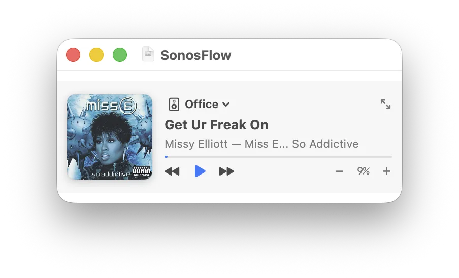

SonosFlow includes a dedicated **Mode A MiniPlayer** and macOS **title bar proxy icon** that make monitoring and exporting media intuitive and seamless.

## Mode A MiniPlayer

Unlike multi-window miniplayers that clutter your desktop with auxiliary windows, **Mode A** smoothly morphs the single main window between full split-view mode and a compact floating card.

### Toggling the MiniPlayer
You can toggle between modes in any of the following ways:
- Press **`⌘M`** on your keyboard.
- Click the MiniPlayer icon (`pip.enter`) in the top header bar.
- Choose "Miniplayer" from the Menu Bar Extra dropdown.
- Press **`Esc`** or click the expand button (`arrow.up.left.and.arrow.down.right`) to restore the full window.

### Window Behaviors
- **Always on Top**: In MiniPlayer mode, the window level automatically elevates to `NSWindow.Level.floating`, keeping your music controls visible above Safari, Xcode, or terminal windows.
- **Cross-Space Visibility**: The window adopts `.canJoinAllSpaces` and `.fullScreenAuxiliary`, allowing it to persist seamlessly as you swipe between macOS virtual desktops.
- **Frame Restoration**: When you return to full mode, SonosFlow animates back to the exact window coordinates and dimensions you had previously.

### MiniPlayer Controls
- **Room Selector Pill**: Click the room badge to switch active Sonos groups on the fly without expanding the app.
- **Hero Artwork**: 84×84 pt album cover with drop shadow.
- **Metadata**: High-contrast title and artist typography with truncation.
- **Mini Transport**: Compact Prev, Play/Pause, Next, and volume step controls.

*Figure: Mode A floating miniplayer with compact album artwork, room badge, playback progress, and transport controls.*

---

## Title Bar Proxy Icon & Drag-and-Drop

When an album cover is cached, SonosFlow binds the physical file on disk to the macOS window via `window.representedURL`.

### Capabilities
1. **Visual File Representation**: A small document icon displaying the album artwork appears directly to the left of the window title in the macOS title bar.
2. **Drag to Export**:
   - Click and drag the proxy icon directly from the title bar to your Desktop, a Finder folder, Messages, Mail, or Slack to instantly export the high-res JPEG image.
3. **Finder Path Hierarchy**:
   - `⌘-click` (or right-click) the window title to reveal the directory path to the cached image in `~/Library/Caches/com.sonosflow.app/Artwork/`.
