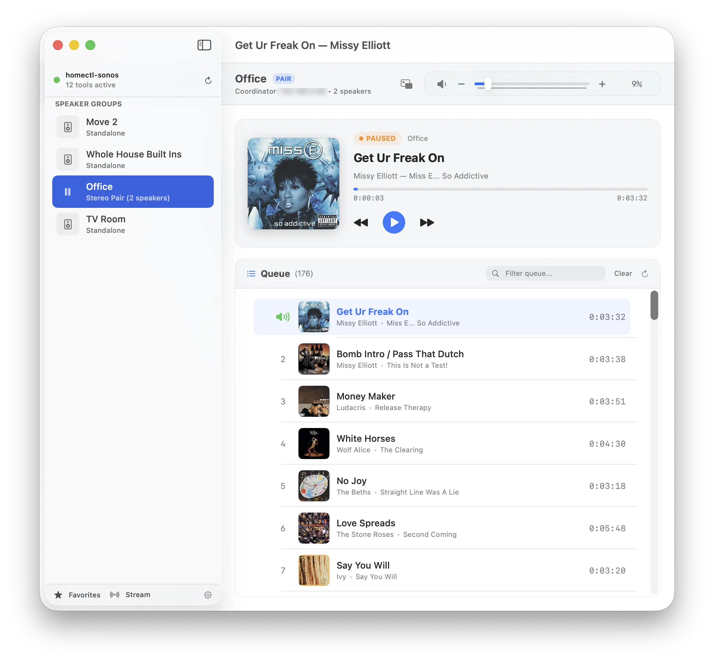
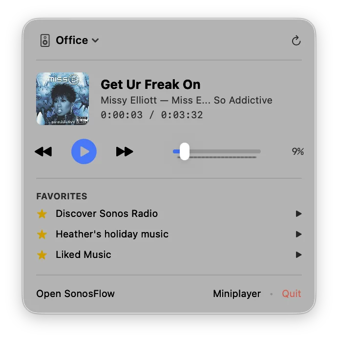
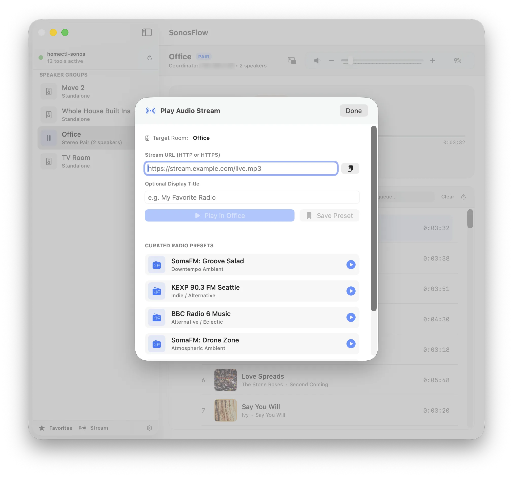

This guide covers the operation, workflows, and advanced capabilities of **SonosFlow**, a native macOS Sonos controller powered by the [`homectl`](https://ghchinoy.github.io/homectl/) Model Context Protocol (MCP) server.

:::caution[Disclaimer]
SonosFlow is an independent open-source community tool. It is **not** an official Sonos product and is not affiliated with or endorsed by Sonos, Inc.
:::

---

## 1. Overview & Architecture

SonosFlow is built with Swift 5.9+ and SwiftUI for macOS 14 Sonoma and later. Similar to [LyriaFlow](https://github.com/ghchinoy/LyriaFlow), it interfaces directly with the [`homectl-sonos`](https://ghchinoy.github.io/homectl/) binary over standard input and output pipes conforming to the Model Context Protocol (MCP) standard `2024-11-05`.

*Figure 1: The main interface featuring the room sidebar, hero now-playing card, and full playback queue.*

---

## 2. Speaker Discovery & Multi-Room Groups

When launched, SonosFlow scans your local Wi-Fi subnet and lists active speaker groups in the left sidebar.

- **Standalone Room**: A single physical speaker (e.g. *Move 2* or *Whole House Port*).
- **Stereo Pair (`PAIR`)**: Two bonded speakers operating as dedicated Left and Right audio channels (e.g. *Office Play:1s*).
- **Multi-Room Group**: Multiple rooms grouped together for synchronized whole-home playback.
- **Switching Rooms**: Click any room in the sidebar, press `⌘1` through `⌘9`, or choose a room from the Menu Bar Extra dropdown.

---

## 3. Interactive Queue Management

SonosFlow provides complete control over the Sonos playback queue for any selected room:

- **Automatic Multi-Page Loading**: Automatically pages through queues larger than 100 tracks in 100-item batches, loading full playlists (e.g. 188 tracks) in milliseconds.
- **Drag-and-Drop Reordering**: Hover over any track to reveal the reorder grip (`⠿`), then drag it to a new position. *(Disabled while searching to prevent index misalignment; clear filter with `Esc` to reorder).*
- **Keyboard Navigation**: Use `↑` / `↓` arrow keys to highlight rows, press **`Return`** to play, and press **`Delete`** or **`Backspace`** to remove.
- **Track Removal**: Hover over a track to reveal the trash icon (`trash`), swipe left with two fingers on a trackpad, or select a track and press `Delete`.
- **"Play Next"**: Right-click any track in the queue and select **Play Next** to insert it directly after the currently playing song via `sonos_queue_edit(as_next: true)`.
- **Clear Entire Queue**: Click **Clear** in the queue header and confirm the dialog to wipe the queue.

---

## 4. Queue Filtering & Search Clarity

- **Search**: Type in the `Filter queue...` field to locate songs across Title, Artist, and Album.
- **True Queue Numbers**: Filtered tracks display their actual queue position (e.g. `#16, #33, #49`). Hovering over a position reveals a tooltip (`"Queue position #16 of 188"`).
- **Active Filter Banner**: Displays `Showing X of Y tracks matching "query" [Clear Filter (Esc)]`.
- **Escape Key (`Esc`)**: Press `Esc` or click the clear button to instantly reset the filter and restore all tracks.

---

## 5. Title Bar Proxy Icon & Drag-to-Export

- **Document Proxy Icon**: A small document icon displaying the album artwork appears in the macOS window title bar next to the song title.
- **Drag-to-Export**: Drag the proxy icon from the title bar directly to your Desktop, Finder, Mail, Messages, or Slack to export the high-res cover JPEG.
- **`⌘-click` Title**: Command-click the window title to reveal the cached image file hierarchy in Finder.

---

## 6. Mode A Floating MiniPlayer (`⌘M`)

*Figure 2: Mode A floating miniplayer with compact album artwork, room badge, playback progress, and transport controls.*

Press **`⌘M`** to collapse SonosFlow into an ultra-compact floating desktop widget:

- **Dynamic Resizing**: Animates smoothly down to **`340×110 pt`**.
- **Always on Top**: Elevates to `.floating` window level to stay visible over other apps.
- **Cross-Space Visibility**: Follows you across virtual desktop spaces (`.canJoinAllSpaces`).
- **Drag Anywhere**: Click and drag anywhere on the widget background to reposition it on screen.
- **Room Switcher**: Click the room badge pill to redirect audio without expanding the app.
- **Restore Full Window**: Press **`⌘M`**, **`Esc`**, or click the expand button.

---

## 7. Menu Bar Extra Companion

*Figure 3: The Menu Bar Extra companion card showing room selector, now playing track, volume, and pinned favorites.*

Even when the main window is closed, the status bar icon remains available:

- Icon shows live state: sound waves (`speaker.wave.3.fill`) when playing, speaker (`hifispeaker`) when idle.
- Dropdown menu allows room switching, transport control, master volume adjustments, and launching top 3 pinned favorites.
- Quick buttons to open the full window or jump directly into the MiniPlayer.

---

## 8. Audio Stream Player & Custom Presets (`⌘U`)

*Figure 4: The Audio Stream Player modal dialog with direct URL entry, curated presets, and custom preset saving.*

Press **`⌘U`** or click **Stream** in the sidebar:

- **Auto-Paste**: Automatically pre-fills audio URLs from your clipboard.
- **Curated Stations**: Built-in 1-click presets for *SomaFM Groove Salad*, *KEXP Seattle*, *BBC Radio 6*, *Drone Zone*, *WNYC*, and *DEF CON Radio*.
- **Save Custom Presets**: Enter any stream link, give it a title, and click **Save Preset** (`bookmark.fill`) to store it permanently in **MY SAVED PRESETS**.

---

## 9. Volume Balancing & Individual Speaker Sliders

- **Master Volume**: Transport slider and step buttons (`⌘↑` / `⌘↓`) adjust room volume in 5% increments. Mute/unmute with `⌘⌥↓` or by clicking the speaker icon (unmuting cleanly restores previous volume; moving the slider above 0 automatically un-mutes). Jitter debouncing prevents background polling from overwriting active drags.
- **Individual Speaker Balance**: For stereo pairs or multi-room groups, click the slider button (`slider.horizontal.2`) beside the volume percentage to open the **Speaker Volumes Popover** and balance individual physical speakers independently.

---

## 10. Hardware Media Keys & Control Center

- **F7, F8, F9**: Mac physical keys control Previous, Play/Pause, and Next on the active Sonos room.
- **AirPods & Bluetooth**: Headphone stem squeezes and tap gestures map directly to Sonos transport actions.
- **macOS Control Center**: High-resolution artwork, track metadata, and timeline scrubbing integrate with the macOS Now Playing menu bar widget.

---

## 11. Hot-Reloading `mcp-sonos` (`⌘⇧R`)

- **Automatic Build Detection**: When the Go agent recompiles `mcp-sonos`, SonosFlow detects the newer file modification timestamp on disk and automatically restarts the child process on the next refresh.
- **Manual Reload**: Press **`⌘⇧R`**, click the reload icon in the sidebar header, or click **Restart** in Settings (`⌘,`).
