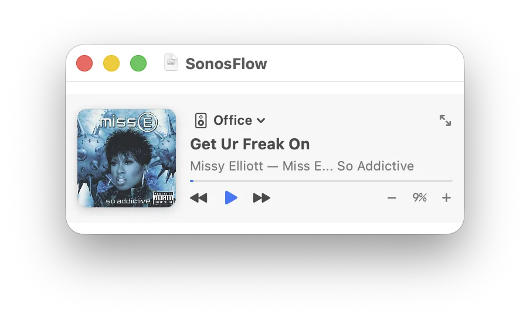
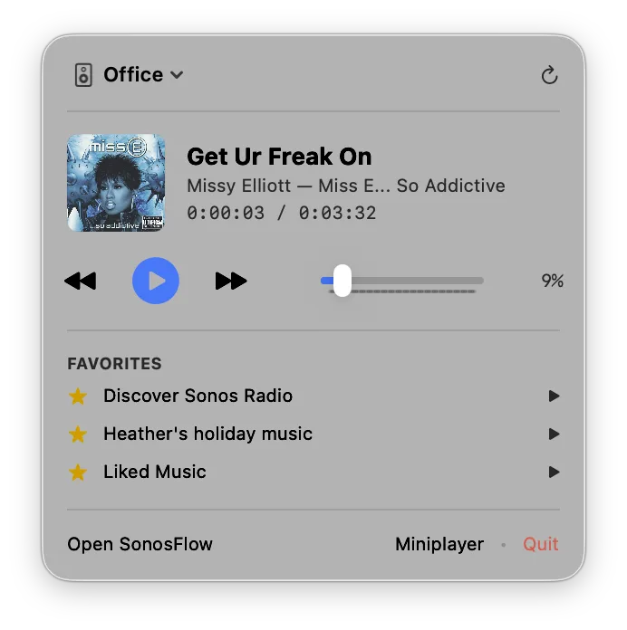
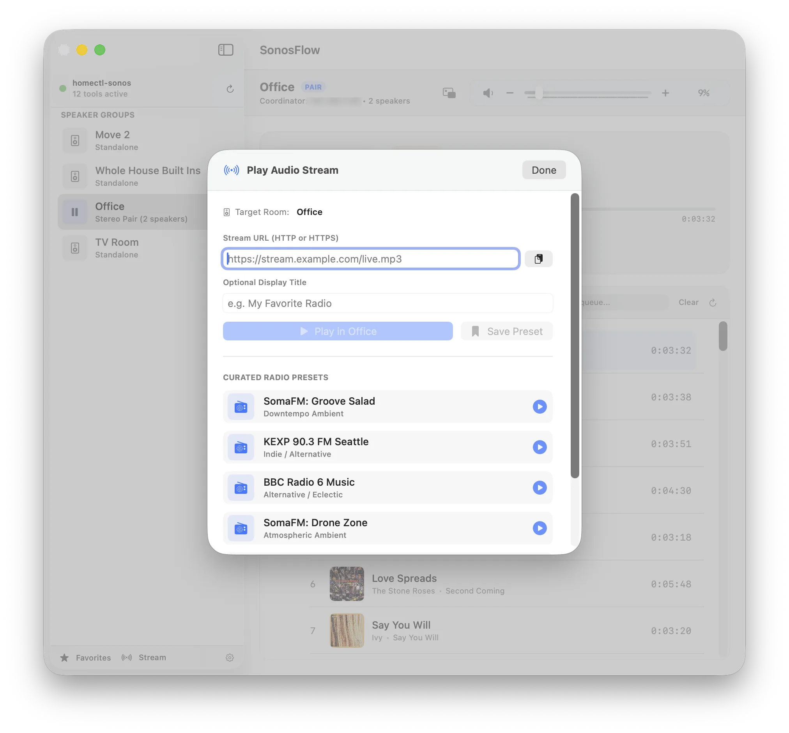

# SonosFlow User Guide

This guide covers the operation, architecture, and feature workflows of **SonosFlow**, a native macOS Sonos controller powered by the local [`homectl`](https://ghchinoy.github.io/homectl/) Model Context Protocol (MCP) server or the official hosted **Sonos 27mcp server**.

---

> ### ⚠️ Disclaimer
> **SonosFlow is an independent, open-source community tool. It is NOT an official Sonos product and is NOT affiliated with, sponsored by, maintained by, or endorsed by Sonos, Inc. in any way.**
>
> "Sonos" and Sonos hardware names (e.g. Sonos Arc, Move, Play:1, Play:3, Port) are registered trademarks of Sonos, Inc.

---

## Table of Contents

1. [Overview & Architecture](#1-overview--architecture)
2. [Prerequisites & Initial Setup](#2-prerequisites--initial-setup)
3. [Installing to Applications Folder](#3-installing-to-applications-folder)
4. [Speaker Discovery & Multi-Room Groups](#4-speaker-discovery--multi-room-groups)
5. [Interactive Queue Management](#5-interactive-queue-management)
6. [Queue Filtering & Search Clarity](#6-queue-filtering--search-clarity)
7. [Title Bar Proxy Icon & Drag-to-Export](#7-title-bar-proxy-icon--drag-to-export)
8. [Mode A Floating MiniPlayer](#8-mode-a-floating-miniplayer)
9. [Menu Bar Extra Companion](#9-menu-bar-extra-companion)
10. [Audio Stream Player & Radio Presets](#10-audio-stream-player--radio-presets)
11. [Volume Balancing & Individual Speaker Sliders](#11-volume-balancing--individual-speaker-sliders)
12. [Hardware Media Keys & macOS Control Center](#12-hardware-media-keys--macos-control-center)
13. [Hot-Reloading the MCP Server](#13-hot-reloading-the-mcp-server)
14. [Diagnostics & Troubleshooting](#14-diagnostics--troubleshooting)
15. [Dual-Engine Control & Feature Gating](#15-dual-engine-control--feature-gating)

---

## 1. Overview & Architecture

SonosFlow is built with Swift 5.9+ and SwiftUI for macOS 14 Sonoma and later. Similar to [LyriaFlow](https://github.com/ghchinoy/LyriaFlow), it interfaces directly with Model Context Protocol (MCP) servers conforming to standard `2024-11-05`. It supports two switchable engines:
- **Local Engine (`homectl-sonos`)**: Connects to the local Go binary over stdio JSON-RPC (<10ms latency, full queue editing, local UPnP audio streams).
- **Sonos Cloud Engine (The Sonos 27mcp Server)**: Connects to Sonos's official hosted endpoint at `https://mcp.ws.sonos.com/mcp` over TLS via OAuth 2.1 PKCE.

<p align="center">
  
</p>

---

## 2. Prerequisites & Initial Setup

### Requirements

- **macOS 14.0 (Sonoma)** or later.
- **Xcode Command Line Tools / Swift 5.9+**.
- **Engine Choice**:
  - **Local Engine**: `mcp-sonos` binary built from [`homectl`](https://ghchinoy.github.io/homectl/) (`make build` at `bin/mcp-sonos`).
  - **Cloud Engine**: Internet connection and a Sonos account.

### Build & Run

```bash
git clone https://github.com/ghchinoy/SonosFlow.git
cd SonosFlow

# 1. Run automated unit test suite (31 tests)
make test

# 2. Launch SonosFlow.app in debug mode
make run
```

---

## 3. Installing to Applications Folder

Install the release bundle into your user's `~/Applications` folder:

```bash
# Build release bundle and install to ~/Applications/SonosFlow.app
make install

# Launch installed app
open ~/Applications/SonosFlow.app
```

To install system-wide for all users:
```bash
make install INSTALL_DIR=/Applications
```

To uninstall:
```bash
make uninstall
```
*(Your settings, Keychain tokens, and album artwork cache are safely preserved).*

---

## 3. Speaker Discovery & Multi-Room Groups

When SonosFlow launches, it discovers all Sonos hardware across your local Wi-Fi subnet.

## 4. Speaker Discovery & Multi-Room Groups

### Understanding Speaker Groups
- **Standalone Room**: A single physical speaker (e.g. *Move 2* or *Whole House Port*).
- **Stereo Pair (`PAIR`)**: Two bonded speakers operating as dedicated Left and Right audio channels (e.g. *Office Play:1s*).
- **Multi-Room Group**: Multiple rooms grouped together for synchronized playback.

### Group Coordinator IP
Sonos uses a coordinator-follower topology. Transport commands (Play, Pause, Seek, Queue mutations) must target the **Group Coordinator IP**. SonosFlow automatically resolves this IP and sends all commands to the authoritative coordinator.

### Switching Rooms
- Click any room in the left sidebar.
- Use keyboard shortcuts **`⌘1`** through **`⌘9`** to jump directly to any discovered room.
- Switch rooms from the macOS Menu Bar Extra dropdown or macOS Dock contextual menu.

---

## 5. Interactive Queue Management

SonosFlow provides deep control over the Sonos playback queue for any selected room.

### Multi-Page Automatic Queue Loading
Sonos queues can hold hundreds of songs. SonosFlow automatically pages through the queue in batches of 100 tracks until all tracks are loaded (e.g. a 188-track queue loads in two fast batches of 100 + 88).

### Drag-and-Drop Reordering
1. Hover over any track in the queue to reveal the reorder grip (`⠿`).
2. Click and drag the track to a new position.
3. The list moves optimistically with zero latency while `sonos_queue_edit(action: 'reorder')` executes in the background.

*Note: To prevent position misalignment, manual drag-and-drop reordering is disabled while an active search filter is applied. Press `Esc` to clear the filter and reorder.*

### Removing Tracks & Keyboard Navigation
- **Play Highlighted Track**: Select any row with arrow keys and press **`Return`** to start playback.
- **Hover Trash Icon**: Move your mouse over any row to reveal the trash button on the right. Click it to remove that track.
- **Trackpad Swipe**: Swipe left with two fingers on any row to delete.
- **Context Menu**: Right-click any row and select **Remove from Queue**.
- **Keyboard Delete**: Highlight a track and press **`Delete`** or **`Backspace`**.

### "Play Next" Action
Want to hear a track next without clearing the queue?
Right-click any song in the queue and select **Play Next**. SonosFlow invokes `sonos_queue_edit(action: 'reorder', as_next: true)` to automatically reposition that track immediately after the currently playing song.

### Clearing the Entire Queue
Click **Clear** in the queue header bar. A native macOS confirmation dialog will appear (`"Are you sure you want to remove all tracks from the queue on <Room>?"`). Confirming wipes the queue.

---

## 6. Queue Filtering & Search Clarity

The queue includes a search field to quickly locate tracks in large playlists.

### Filtering by Name or Artist
Type in the **Filter queue...** text field. The list updates in real time to show only matching tracks across Title, Artist, and Album.

### True Queue Positions
When filtered, each track displays its **true queue position** (e.g. displaying `#16, #33, #49` when filtering for *"ce"*). Hovering over the position number reveals a tooltip: `"Queue position #16 of 188"`.

### Active Filter Banner & Escape Key
- An active filter pill appears: `Showing 8 of 188 tracks matching "query" [Clear Filter (Esc)]`.
- Press **`Esc`** at any time while the search field is active, or click **Clear Filter**, to instantly restore the full queue.

---

## 7. Title Bar Proxy Icon & Drag-to-Export

SonosFlow integrates with macOS's document proxy icon system.

### How It Works
When a track plays, its album artwork is stored in the local two-tier cache (`~/Library/Caches/com.sonosflow.app/Artwork/`). SonosFlow binds this physical file to the macOS window via `window.representedURL`.

### Drag to Export
1. Hover over the document icon next to the window title in the macOS title bar.
2. Click and drag the icon directly to:
   - **Desktop or Finder**: Saves the full-resolution album cover JPEG.
   - **Messages / Mail / Slack**: Attaches the album artwork directly.
3. **`⌘-click` Title Bar**: Shows the folder path in Finder hierarchy.

---

## 8. Mode A Floating MiniPlayer

<p align="center">
  
</p>

Press **`⌘M`** to collapse SonosFlow into an ultra-compact floating desktop widget.

### Widget Behaviors
- **Window Morphing**: The window smoothly animates down to **`340×110 pt`**.
- **Always on Top**: Window level elevates to `.floating`, staying above browser and editor windows.
- **Cross-Space Visibility**: Follows you across virtual desktop spaces (`.canJoinAllSpaces`).
- **Click to Drag Anywhere**: Click and drag anywhere on the widget background to reposition it.
- **In-Widget Room Switcher**: Click the room badge pill to switch rooms without expanding the app.
- **Restore Full Window**: Press **`⌘M`**, press **`Esc`**, or click the expand button (`arrow.up.left.and.arrow.down.right`).

---

## 9. Menu Bar Extra Companion

<p align="center">
  
</p>

Even when the main window is closed, SonosFlow remains accessible in the macOS status bar.

### Features
- Status bar icon reflects playback state: animated waves (`speaker.wave.3.fill`) when playing, speaker (`hifispeaker`) when idle.
- Room dropdown to direct audio without opening the window.
- 54×54 pt artwork thumbnail, track metadata, and elapsed duration.
- Master volume slider and step controls.
- Top 3 pinned Sonos favorites for 1-click playback.
- Shortcuts to open the full window or jump directly into the MiniPlayer.

---

## 10. Audio Stream Player & Radio Presets

<p align="center">
  
</p>

Press **`⌘U`** or click **Stream** in the sidebar to stream live audio directly into any room using `sonos_play_stream`.

### Playing an Audio Stream
1. Copy an audio stream link (`http://` or `https://`).
2. Open the Stream dialog (`⌘U`) — SonosFlow will automatically detect the stream URL from your clipboard.
3. Enter an optional title (e.g. *"Radio Paradise"*).
4. Click **Play in Room**.

### Curated Radio Presets
Click any curated station chip to start listening immediately:
- **SomaFM: Groove Salad** (Downtempo / Ambient)
- **KEXP 90.3 FM Seattle** (Indie / Alternative)
- **BBC Radio 6 Music** (Alternative / Eclectic)
- **SomaFM: Drone Zone** (Atmospheric Ambient)
- **WNYC 93.9 FM New York** (Public Radio / News)
- **SomaFM: DEF CON Radio** (Electronic / Hacker)

### Saving Custom Presets
1. Enter your custom stream URL and station title.
2. Click **Save Preset** (`bookmark.fill`).
3. Your station is saved to **MY SAVED PRESETS** (persisted in macOS `UserDefaults`).
4. Custom presets appear with a dedicated star badge and a trash icon to remove them anytime.

---

## 11. Volume Balancing & Individual Speaker Sliders

### Master Room Volume
- Use the transport slider or step buttons (`⌘↑` / `⌘↓`) to adjust master room volume in 5% increments.
- Mute/unmute with **`⌘⌥↓`** or by clicking the speaker icon. Unmuting cleanly restores your prior volume level, and dragging the slider above 0 automatically un-mutes.
- Background polling incorporates a 1.2s guard window to eliminate slider jitter while actively dragging.

### Individual Speaker Volumes in Groups
When listening on a stereo pair (e.g. paired Play:1s) or multi-room group:
1. An adjustment button (`slider.horizontal.2`) appears beside the master volume percentage.
2. Click it to open the **Speaker Volumes Popover**:
   - Master volume slider at the top.
   - Individual sliders for every physical speaker in the group.
   - Host/Coordinator badges indicate which speaker is the master.
   - Adjust left vs. right or surround balances independently.

---

## 12. Hardware Media Keys & macOS Control Center

SonosFlow connects directly to Apple's `MediaPlayer.framework`.

### Physical Media Keys
- **`F8`**: Play / Pause toggle on active Sonos room.
- **`F9`**: Skip to Next track.
- **`F7`**: Return to Previous track.
- **AirPods & Bluetooth Headphones**: Stem squeezes and button presses trigger Sonos actions.

### macOS Control Center
Audio metadata publishes directly to the macOS Control Center Now Playing widget:
- Displays high-resolution album artwork loaded from the two-tier cache.
- Shows track title, artist, and album.
- Interactive timeline scrubber and playback controls.

---

## 13. Hot-Reloading the MCP Server

When developing or updating the Go `mcp-sonos` binary, SonosFlow provides zero-downtime hot-reloading.

### Automatic Binary Update Detection
`MCPClient` tracks the file modification timestamp (`mtime`) of `mcp-sonos`. Whenever a refresh runs, if a newly compiled binary is detected on disk, SonosFlow logs:
`"Detected updated mcp-sonos binary on disk. Hot-reloading server..."`
and restarts the child process automatically.

### Manual Reload
- Press **`⌘⇧R`**.
- Click the reload icon in the sidebar header beside the tool count.
- Click **Restart** in Settings (`⌘,`).

---

## 14. Diagnostics & Troubleshooting

### Log Inspection
SonosFlow writes diagnostics to:
```bash
~/Library/Logs/SonosFlow/sonosflow.log
```
To tail logs in Terminal:
```bash
tail -f ~/Library/Logs/SonosFlow/sonosflow.log
```
Or open Settings (`⌘,`) and click **Reveal Log in Finder**.

### Cache Management
In Settings (`⌘,`):
- **Storage Used**: Shows disk footprint (e.g. `24.8 MB (142 covers)`).
- **Reveal in Finder**: Opens `~/Library/Caches/com.sonosflow.app/Artwork/`.
- **Clear Cache**: Clears both memory and disk caches.

---

## 15. Dual-Engine Control & Feature Gating

SonosFlow provides an interactive **Control Engine switch** in Settings (`⌘,`), allowing you to choose between the local edge-first engine and the official hosted Sonos 27mcp server.

### 1. Local Engine (`homectl-sonos`) [Default]
- **Zero Login**: Communicates via direct stdio pipes to the local Go binary.
- **Ultra-low latency**: <10ms local network dispatch.
- **Full Queue Management**: 188-track interactive queue, drag-and-drop reordering, hover deletion, and "Play Next".
- **Audio Streams (`⌘U`)**: Direct local UPnP playback for any internet radio or podcast stream URL.

### 2. The Sonos 27mcp Server (Official Cloud)
- **OAuth 2.1 PKCE**: Sign in with your Sonos account directly from Settings. Tokens are securely stored in the macOS Keychain.
- **Remote / VPN Support**: Allows controlling your speakers across VLANs, guest networks, or while away from home.
- **Dynamic Feature Gating**:
  - The queue pane automatically transitions into an **"Up Next" preview card** showing the upcoming track announced by the cloud server.
  - The Stream sidebar button and `⌘U` shortcut are cleanly hidden, as cloud APIs do not support local UPnP streams.
  - Sidebar and header show a discrete `[CLOUD]` pill badge.
- **Resilient Error Banners**: If cloud authentication expires or connectivity drops, SonosFlow displays an error banner with **Sign In** and **Use Local** buttons, giving you instant recovery without unprompted auto-switches.
